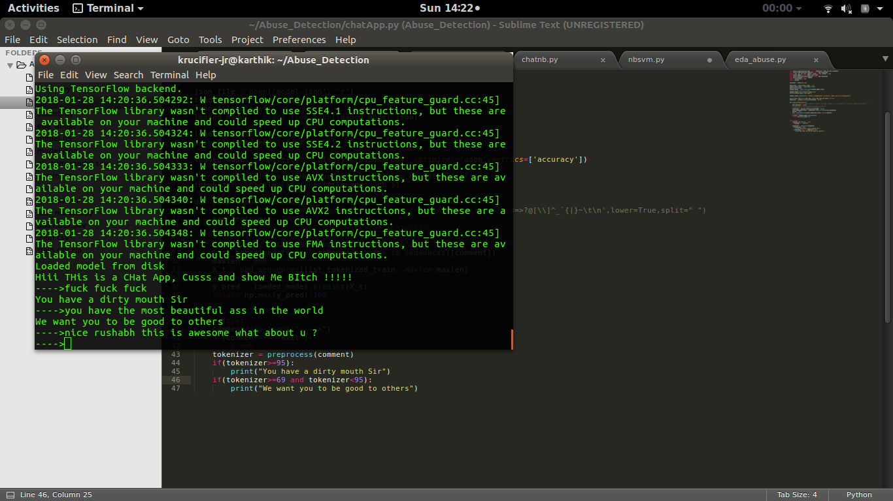

# Abuse_Detection
Codeshastra 2018 Qualifier Project

## LSTM Keras Implementation 

This is the implementation of LSTM-RNN based Deep Learning algorithm in order to detect Profanity

DataSet : https://www.kaggle.com/c/jigsaw-toxic-comment-classification-challenge

## Chat Application

This is a basic NLP project which takes everything from Tokenization to RNN implementation
